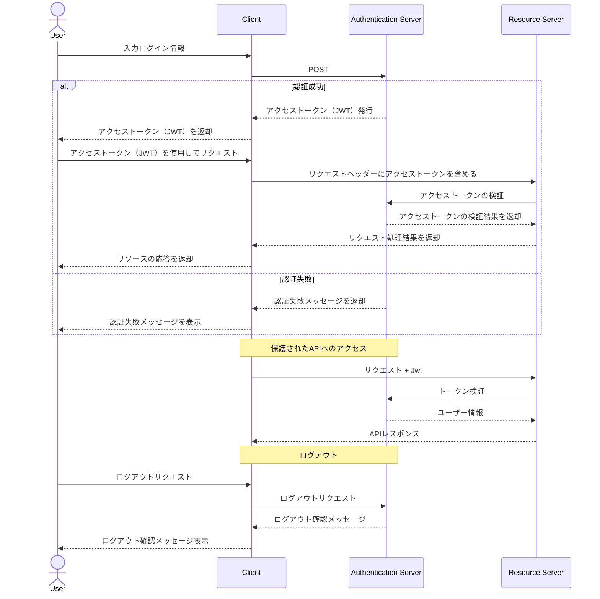

通常のtokenとの違い

1. トークン生成と検証
- JWT: トークン自体に情報が含まれ、秘密鍵で検証可能
- シンプルトークン: ランダムな文字列で、必ずDBで検証が必要

2. サーバーサイドの状態管理
- JWT: 基本的にステートレス（DB検証不要）
- シンプルトークン: トークンとユーザー情報をDBで管理

3. トークンの無効化
- JWT: 有効期限までサーバーで無効化が難しい
- シンプルトークン: DBから削除することで即時無効化可能

4. セキュリティ特性
- JWT: 改ざん検知が可能
- シンプルトークン: 予測不可能な文字列であることが重要

5. スケーラビリティ
- JWT: サーバー間で共有する情報が少ない
- シンプルトークン: トークンDBの共有が必要

このような違いにより、用途に応じて適切な方式を選択する必要があります。 シンプルなトークン認証は、より厳密なセッション管理が必要な場合や、即時の無効化が重要な場合に適しています。