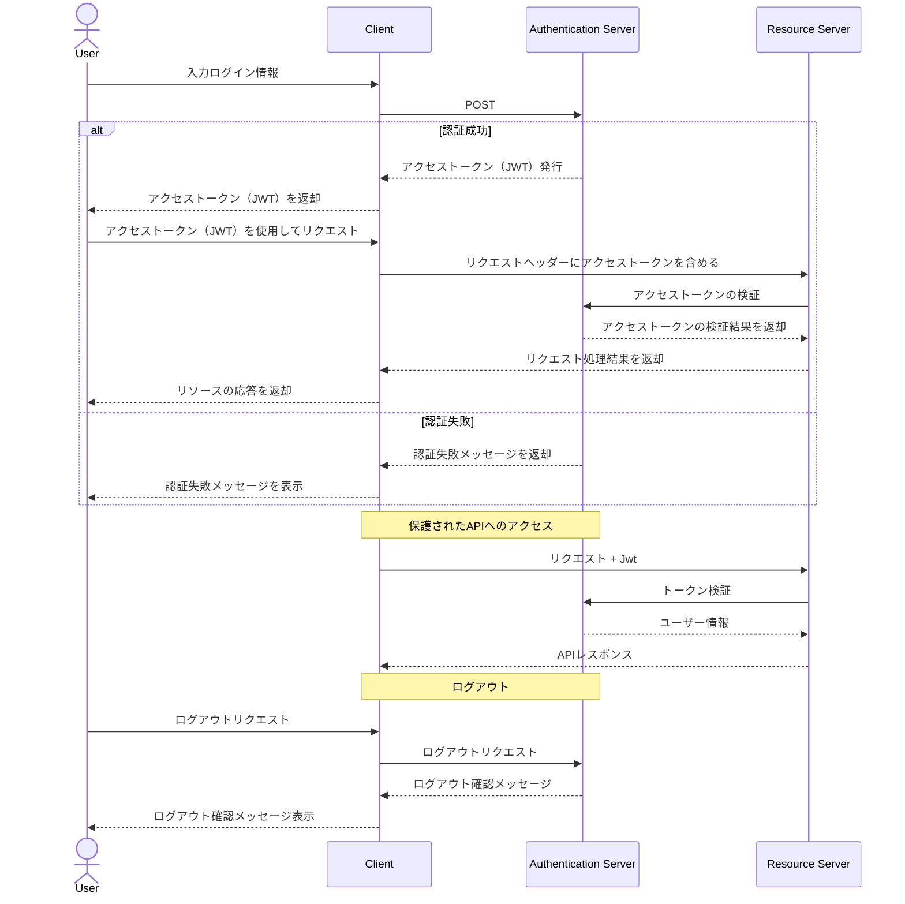

### JWTとは？
まず、JWTは「JSON Web Token」の略です。これは「デジタル署名付きのIDカード」のようなものだと考えてください。

### 仕組みを例え話で説明すると...

お店（ウェブサイト）に行く時のことを想像してください：

1. **ログイン（身分証明）**
```
あなた：「こんにちは！私はAさんです。パスワードは1234です」
お店：「確認しました。このIDカード（JWT）を渡します」
```

2. **IDカード（JWT）の中身**
```
- 名前：Aさん
- 会員番号：12345
- 有効期限：2024年3月1日まで
- お店の印鑑（デジタル署名）
```

3. **お店を利用する時（APIにアクセスする時）**
```
あなた：「商品を見たいです。はい、IDカードです」
お店：「IDカードを確認しました。どうぞご覧ください」
```

通常のtokenとの違い

1. トークン生成と検証
    - JWT: トークン自体に情報が含まれ、秘密鍵で検証可能
    - シンプルトークン: ランダムな文字列で、必ずDBで検証が必要

2. サーバーサイドの状態管理
    - JWT: 基本的にステートレス（DB検証不要）
    - シンプルトークン: トークンとユーザー情報をDBで管理

3. トークンの無効化
    - JWT: 有効期限までサーバーで無効化が難しい
    - シンプルトークン: DBから削除することで即時無効化可能

4. セキュリティ特性
    - JWT: 改ざん検知が可能
    - シンプルトークン: 予測不可能な文字列であることが重要