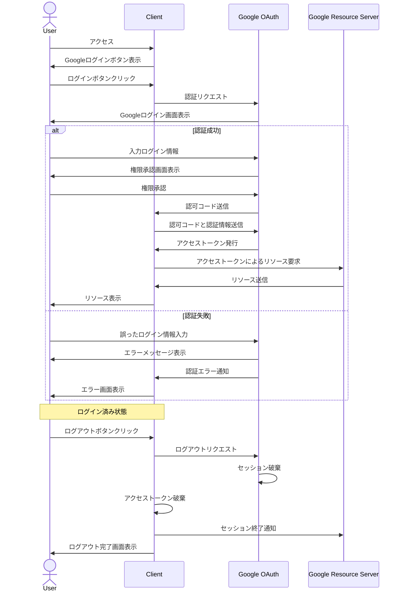

通常のtokenとの違い
OAuthと通常のトークン認証のメリット・デメリットを比較してご説明します。

OAuthのメリット:
1. セキュリティ
- パスワードを直接アプリケーションに渡す必要がない

2. ユーザー体験
- 既存のアカウント（Google、Facebookなど）でログイン可能
- 複数サービスで同じアカウントが使える（シングルサインオン）
- パスワードを覚える必要が少ない

3. 開発・運用
- 認証基盤の実装・運用コストを削減できる
- 標準化されたプロトコルで相互運用性が高い
- セキュリティのベストプラクティスが組み込まれている

OAuthのデメリット:
1. 複雑性
- 実装が比較的複雑
- フローの理解・管理が必要
- エラーハンドリングが複雑

2. 依存性
- 認証プロバイダーに依存
- プロバイダーの障害時にサービスに影響
- プロバイダーの仕様変更への対応が必要

通常のトークン認証のメリット:
1. シンプル
- 実装が比較的容易
- フローが単純で理解しやすい
- 完全に自社でコントロール可能

2. カスタマイズ性
- 要件に応じた柔軟な実装が可能
- 認証ロジックの完全なカスタマイズが可能

通常のトークン認証のデメリット:
1. セキュリティ
- セキュリティの実装を一から行う必要がある
- パスワード管理のリスク
- トークン管理の仕組みを自前で実装必要

2. 運用コスト
- 認証基盤の運用・保守が必要
- セキュリティアップデートへの対応
- スケーリング時の考慮が必要

選択の基準：
1. プロジェクトの規模
- 小規模：通常のトークン認証で十分な場合も
- 大規模：OAuthの方が運用面で有利

2. セキュリティ要件
- 高セキュリティ必要：OAuthが推奨
- 比較的低リスク：通常のトークン認証も選択肢

3. ユーザー層
- 一般消費者向け：OAuthでの利便性重視
- 企業内システム：既存の認証システムに応じて選択

4. 開発リソース
- 開発期間短い：既存のOAuth活用
- リソース十分：要件に応じて選択可能

実際の選択では、これらの要素を総合的に判断することが重要です。また、ハイブリッドアプローチ（両方の認証方式を提供）も選択肢の一つとなります。