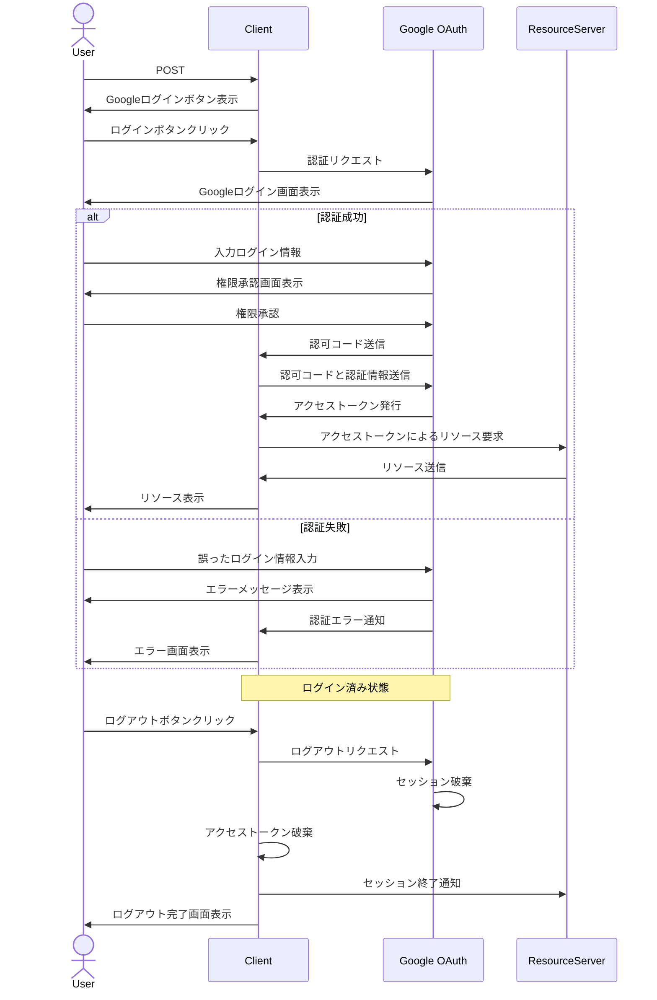

OAuthのメリット:
1. セキュリティ
    - パスワードを直接アプリケーションに渡す必要がない
    - 既存のアカウント（Google、Facebookなど）でログイン可能
    - 複数サービスで同じアカウントが使える（シングルサインオン）
    - パスワードを覚える必要が少ない

2. 開発・運用
    - 認証基盤の実装・運用コストを削減できる
    - 標準化されたプロトコルで相互運用性が高い
    - セキュリティのベストプラクティスが組み込まれている

OAuthのデメリット:
1. 複雑性
    - 実装が比較的複雑
    - フローの理解・管理が必要

2. 依存性
    - 認証プロバイダーに依存
    - プロバイダーの障害時にサービスに影響
    - プロバイダーの仕様変更への対応が必要

通常のトークン認証のメリット:
1. シンプル
    - 実装が比較的容易
    - フローが単純で理解しやすい
    - 完全に自社でコントロール可能

2. カスタマイズ性
    - 要件に応じた柔軟な実装が可能
    - 認証ロジックの完全なカスタマイズが可能

通常のトークン認証のデメリット:
1. セキュリティ
    - セキュリティの実装を一から行う必要がある
    - パスワード管理のリスク
    - トークン管理の仕組みを自前で実装必要

2. 運用コスト
    - 認証基盤の運用・保守が必要
    - セキュリティアップデートへの対応
    - スケーリング時の考慮が必要
