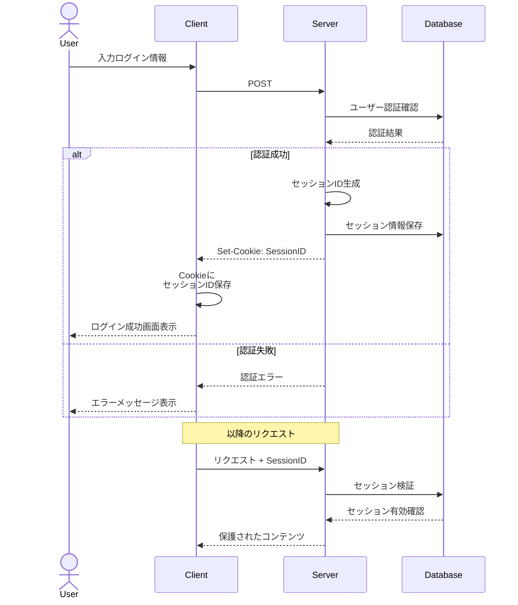

メリット：
1. 実装の容易さ
- 多くのWebフレームワークで標準的にサポート
- 従来からの確立された認証方式で実装例が豊富
- セッション管理をサーバー側で一元的に行える

2. セキュリティ面
- セッションIDのみをクライアントに保持し、機密情報はサーバーで管理
- セッションタイムアウトの設定が容易
- セッション無効化（ログアウト）が確実に行える

デメリット：
1. スケーラビリティの課題
- サーバーでセッション情報を保持するため、メモリ消費が増大
- 複数サーバーでの運用時、セッション情報の同期が必要
- 水平スケーリングが複雑になる
- RestfulAPIとの親和性の低さ

2. ステートフル性による制約
- サーバー側で状態を保持する必要がある
- サーバーダウン時にセッション情報が失われる可能性

3. API利用での制約
- Cookieベースの制限
- クロスオリジンでの制約