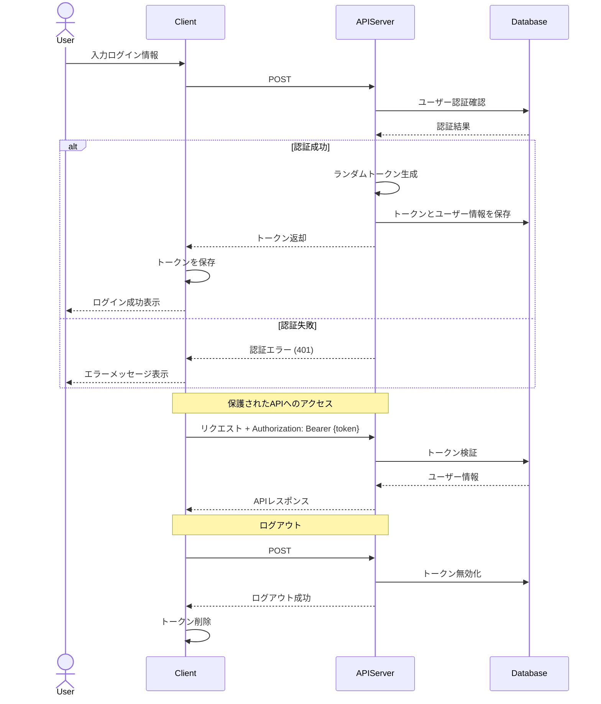

メリット：
1. APIとの親和性
- HTTPヘッダーでの認証が標準的
- クロスプラットフォームでの実装が容易
- モバイルアプリなどでも扱いやすい

2. セキュリティ管理
- トークンの即時無効化が可能
- トークンの有効期限管理が容易
- アクティブなセッション（トークン）の把握が容易

3. 実装の柔軟性
- トークンに紐づく情報の管理が自由

デメリット：
1. パフォーマンス
- 毎リクエストでDBアクセスが必要
- トークン検証のオーバーヘッド
- DBへの負荷が高い

2. スケーラビリティ
- トークン情報のDB同期が必要
- 分散システムでの管理が複雑
- DBのボトルネック

使い分けのポイント：
1. アプリケーションの性質
- Webアプリケーション中心 → セッション認証
- API中心のシステム → トークン認証

2. スケール要件
- 単一サーバー/小規模 → セッション認証
- 大規模/分散システム → トークン認証

3. クライアントの多様性
- ブラウザのみ → セッション認証
- 多様なクライアント → トークン認証